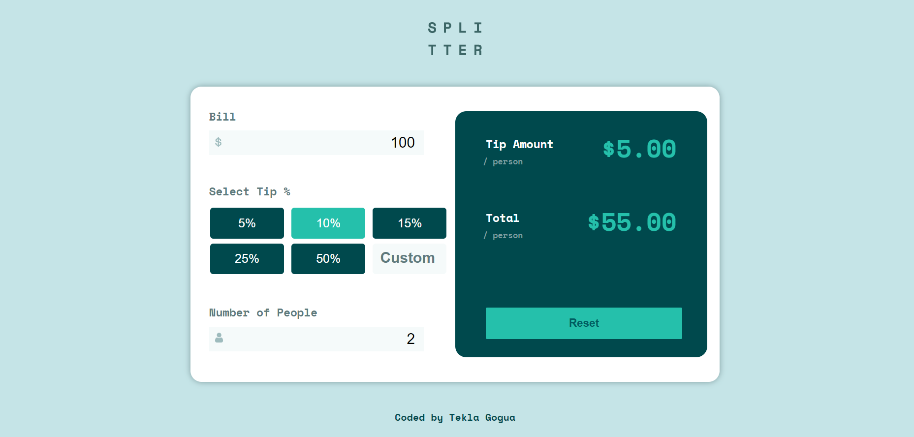

# Frontend Mentor - Tip calculator app

## Table of contents

- [Overview](#overview)
  - [The challenge](#the-challenge)
  - [Screenshot](#screenshot)
  - [Links](#links)
- [My process](#my-process)
  - [Built with](#built-with)
  - [Useful resources](#useful-resources)
- [Author](#author)

## Overview

### The challenge

Users should be able to:

- View the optimal layout for the app depending on their device's screen size
- See hover states for all interactive elements on the page
- Calculate the correct tip and total cost of the bill per person

### Screenshot

.jpg)

.jpg>)

### Links

- Solution URL: https://github.com/teklaGogua/Tip-Calculator
- Live Site URL: https://teklagogua.github.io/Tip-Calculator/

## My process

### Built with

- JavaScript
- CSS
- HTML

### Useful resources

- [toFixed()](https://www.w3schools.com/jsref/jsref_tofixed.asp) - This helped me to display results.
- [parseFloat()](https://developer.mozilla.org/en-US/docs/Web/JavaScript/Reference/Global_Objects/parseFloat) - This helped me get usable argumens from Custom input.

## Author

- Website - [Tekla Gogua](https://github.com/teklaGogua)
